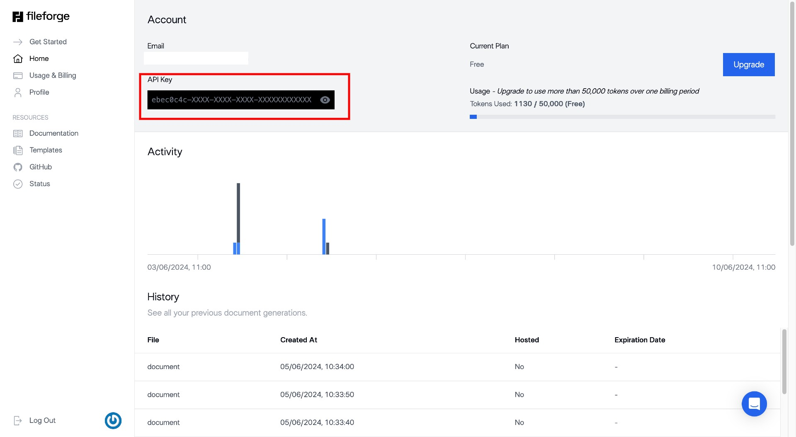

Authenticating in the Fileforge API is done using an API key. This key is used to authenticate your requests to the API. You can create an API key in the [Fileforge app](https://app.onedoclabs.com).

<Steps>
  ### Get your API key 🔑
    Go to the [Fileforge app](https://app.onedoclabs.com) and create an API key.
    
  ### Add your key to the request headers 
    Add your API key to the `Authorization` header in your requests with `X-API-Key`. You can test your key with the [status endpoint](/api-reference/api-reference/get-status) using the playground.

  ### You are all set! ✅
  You are good to go and can use any of the endpoints in the API. 👷
</Steps>