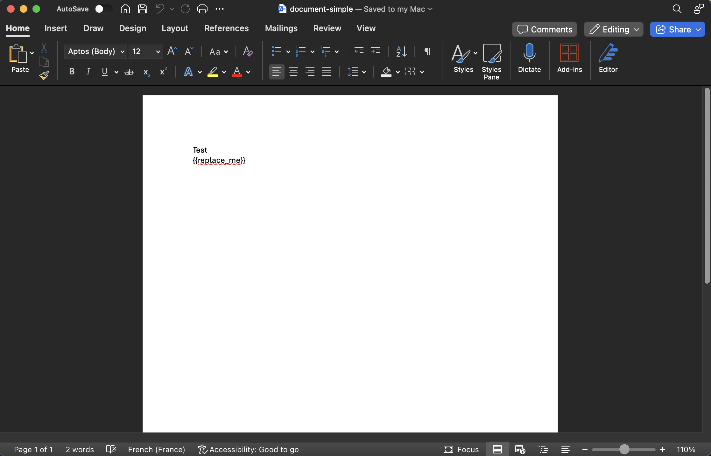

This documentation provides an example of how to use the FileforgeClient to convert a DOCX with variables into PDF.

#### Prerequisites

Ensure you have the following:

- An API key for Fileforge as an environment variable: **process.env.FILEFORGE_API_KEY**
- Node.js and npm installed.
- The Fileforge Client [installed](/getting-started/general/authentication).

#### Guide

<Steps>

### Write your DOCX document with a variable (optional)



### Write the `templateLiterals` object with the variable to replace

```json
"templateLiterals": {
    "replace_me": "John Doe",
}
```

### Generate the PDF

The templateLiterals object is passed in the options parameter. Please note that the options parameter is optional in the event where your document has no variables.
The document is returned as a stream, which can be piped to a file or other writable stream.

```typescript
import { FileforgeClient } from "@fileforge/client";
import * as fs from "fs";

(async () => {
    const ff = new FileforgeClient({
      apiKey: process.env.FILEFORGE_API_KEY,
    });

    try {
      const docxFile = fs.createReadStream(
        __dirname + "/samples/document-simple.docx",
      );
      const pdfStream = await ff.pdf.fromDocx(
        docxFile,
        { 
        options:{
          "templateLiterals": {
            "replace_me": "John Doe",
          }
        }
        },
        {
          timeoutInSeconds: 30,
        },
      );

      pdfStream.pipe(fs.createWriteStream("./result_docx.pdf"));
      console.log("PDF conversion successful. Stream ready.");

    } catch (error) {
      console.error("Error during PDF conversion:", error);
      throw error;
    }
  })();
```

</Steps>