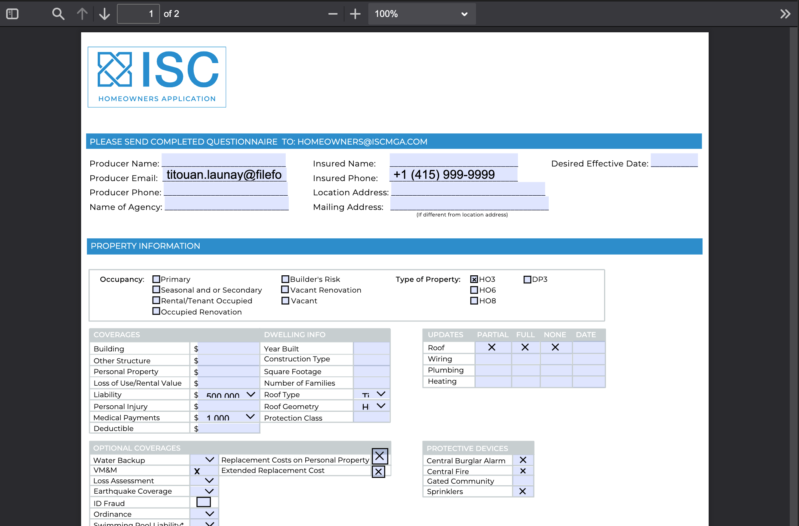

This documentation provides an example of how to use the FileforgeClient to detect form fields in a PDF document.
This endpoint returns a list of form fields detected in the PDF document, along with their location, options and requirements.

#### Prerequisites

Ensure you have the following:

- An API key for Fileforge as an environment variable: **process.env.FILEFORGE_API_KEY**
- Node.js and npm installed.
- The Fileforge Client [installed](/getting-started/general/authentication).

#### Guide

<Steps>

### Lets look into our PDF file with a form

For this example, we will use the following PDF file with form fields:



### Extract form fields from the PDF as object

```typescript
import { FileforgeClient } from "@fileforge/client";
import * as fs from "fs";

(async () => {
    const ff = new FileforgeClient({
      apiKey: process.env.FILEFORGE_API_KEY,
    });

    try {
      const resultObject = await ff.pdf.form.detect(
        new File(
          [fs.readFileSync(__dirname + "/samples/form.pdf")],
          "form.pdf",
          {
            type: "application/pdf",
          },
        ),
        { options: {} },
      );

      console.log(resultObject);
    } catch (error) {
      console.error("Error during PDF form detect:", error);
      throw error;
    }
  })();
```

### Get all form field descriptions and locations from the response as follows
The reponse is a list of field descriptions and locations you can use to build a mapping with your data or to fill the document.
```json
[
    {
    "name":"Producer Name",
    "required":false,
    "readOnly":false,
    "locations":[
        {
            "x":78.6,
            "y":660.36,
            "width":120.96000000000001,
            "height":13.559999999999945
        }
    ],
    "type":"PDFTextField",
    "defaultValue":"",
    "isPassword":false,
    "isRichFormatted":false,
    "isScrollable":true,
    "isCombed":false,
    "isMultiline":false,
    "isFileSelector":false
    },
    {
    "name":"Insured Name",
    "required":false,
    "readOnly":false,
    "locations":[
        {
            "x":300.96,
            "y":660.36,
            "width":125.16000000000003,
            "height":13.559999999999945
        }
    ],
    "type":"PDFTextField",
    "defaultValue":"",
    "isPassword":false,
    "isRichFormatted":false,
    "isScrollable":true,
    "isCombed":false,
    "isMultiline":false,
    "isFileSelector":false
    },
    {
    "name":"Desired Effective Date",
    "required":false,
    "readOnly":false,
    "locations":[
        {
            "x":555.72,
            "y":660.36,
            "width":45.83999999999992,
            "height":13.559999999999945
        }
    ],
    "type":"PDFTextField",
    "defaultValue":"",
    "isPassword":false,
    "isRichFormatted":false,
    "isScrollable":true,
    "isCombed":false,
    "isMultiline":false,
    "isFileSelector":false
    },
    {
    "name":"Producer Email",
    "required":false,
    "readOnly":false,
    "locations":[
        {
            "x":79.32,
            "y":646.32,
            "width":120.96000000000001,
            "height":13.559999999999945
        }
    ],
    "type":"PDFTextField",
    "defaultValue":"titouan.launay@fileforge.com",
    "isPassword":false,
    "isRichFormatted":false,
    "isScrollable":true,
    "isCombed":false,
    "isMultiline":false,
    "isFileSelector":false
    },
    {
    "name":"Insured Phone",
    "required":false,
    "readOnly":false,
    "locations":[
        {
            "x":300.72,
            "y":646.32,
            "width":125.15999999999997,
            "height":13.559999999999945
        }
    ],
    "type":"PDFTextField",
    "defaultValue":"+1 (415) 999-9999",
    "isPassword":false,
    "isRichFormatted":false,
    "isScrollable":true,
    "isCombed":false,
    "isMultiline":false,
    "isFileSelector":false
    }
...
]
```


</Steps>