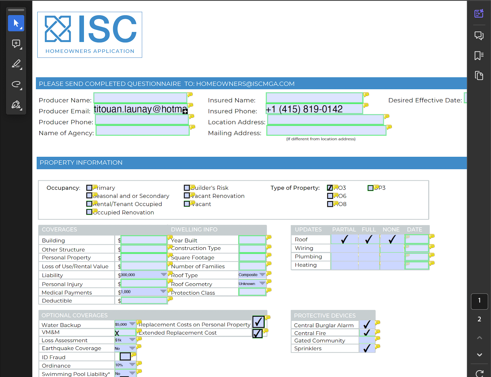

This documentation provides an example of how to use the FileforgeClient to fill forms in a PDF document.
This endpoint returns modified version of the PDF you submit with the filled form, according to the data you provide.

#### Prerequisites

Ensure you have the following:

- An API key for Fileforge as an environment variable: **process.env.FILEFORGE_API_KEY**
- Node.js and npm installed.
- The Fileforge Client [installed](/getting-started/general/authentication).

#### Guide

<Steps>

### Prepare the form data as a list of object as follows

```typescript
[
    {
        name: "Producer Name",
        type: "PDFTextField",
        value: "Titouan Launay", // fills a text field
    },
    {
        name: "Check Box4",
        type: "PDFCheckBox",
        checked: false, // unchecks a box
    },
]
```

### Mark form fields from the PDF and retrieve a modified PDF

```typescript
import { FileforgeClient } from "@fileforge/client";
import * as fs from "fs";
import { pipeline } from 'stream';
import { promisify } from 'util';

const pipelineAsync = promisify(pipeline);

(async () => {
    const ff = new FileforgeClient({
      apiKey: process.env.FILEFORGE_API_KEY,
    });

    try {
      const formFillRequest = {
        options: {
          fields: [
            {
              name: "Producer Name",
              type: "PDFTextField",
              value: "Pierre Dorge"
            },
            {
                name:"Check Box4",
                type:"PDFCheckBox",
                checked: false
            },
          ],
        },
      };
      const requestOptions = {
        timeoutInSeconds: 60,
        maxRetries: 3,
      };
      const filledPdfStream = await ff.pdf.form.fill(
        new File(
          [fs.readFileSync(__dirname + "/form.pdf")],
          "form.pdf",
          {
            type: "application/pdf",
          },
        ),
        formFillRequest,
        requestOptions,
      );

      
      await pipelineAsync(filledPdfStream, fs.createWriteStream("./result_filled.pdf")); // ensures the whole file is written before the stream is closed

      console.log("PDF form filling successful. Stream ready.");
    } catch (error) {
      console.error("Error during PDF form filling:", error);
    }
  })();
```

### Get a modified PDF
The reponse is stream of the modified PDF with form fields marked with a green border, and hover text showing the field name.




</Steps>