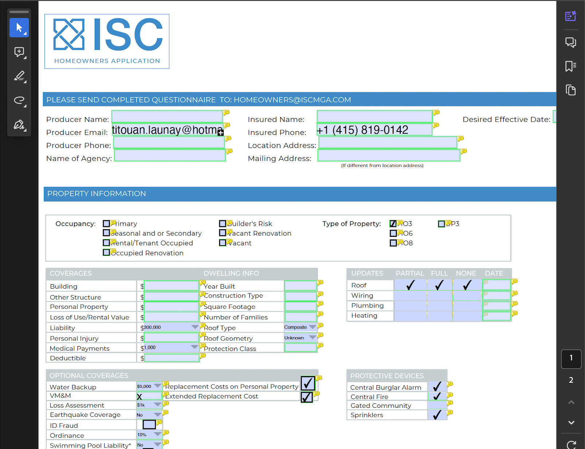

This documentation provides an example of how to use the FileforgeClient to mark form fields in a PDF document.
This endpoint returns modified version of the PDF you submit with form fields marked with a green border, and hover text showing the field name.

#### Prerequisites

Ensure you have the following:

- An API key for Fileforge as an environment variable: **process.env.FILEFORGE_API_KEY**
- Node.js and npm installed.
- The Fileforge Client [installed](/getting-started/general/authentication).

#### Guide

<Steps>

### Mark form fields from the PDF and retrieve a modified PDF

```typescript
import { FileforgeClient } from "@fileforge/client";
import * as fs from "fs";

(async () => {
    const ff = new FileforgeClient({
      apiKey: process.env.FILEFORGE_API_KEY,
    });

    try {
      const pdfStream = await ff.pdf.form.mark(
        new File(
          [fs.readFileSync(__dirname + "/samples/form.pdf")],
          "form.pdf",
          {
            type: "application/pdf",
          },
        ),
        { options: {} },
      );

      pdfStream.pipe(fs.createWriteStream("./result_mark.pdf"));
    } catch (error) {
      console.error("Error during PDF form mark:", error);
      throw error;
    }
  })();
```

### Get a modified PDF
The reponse is stream of the modified PDF with form fields marked with a green border, and hover text showing the field name.




</Steps>